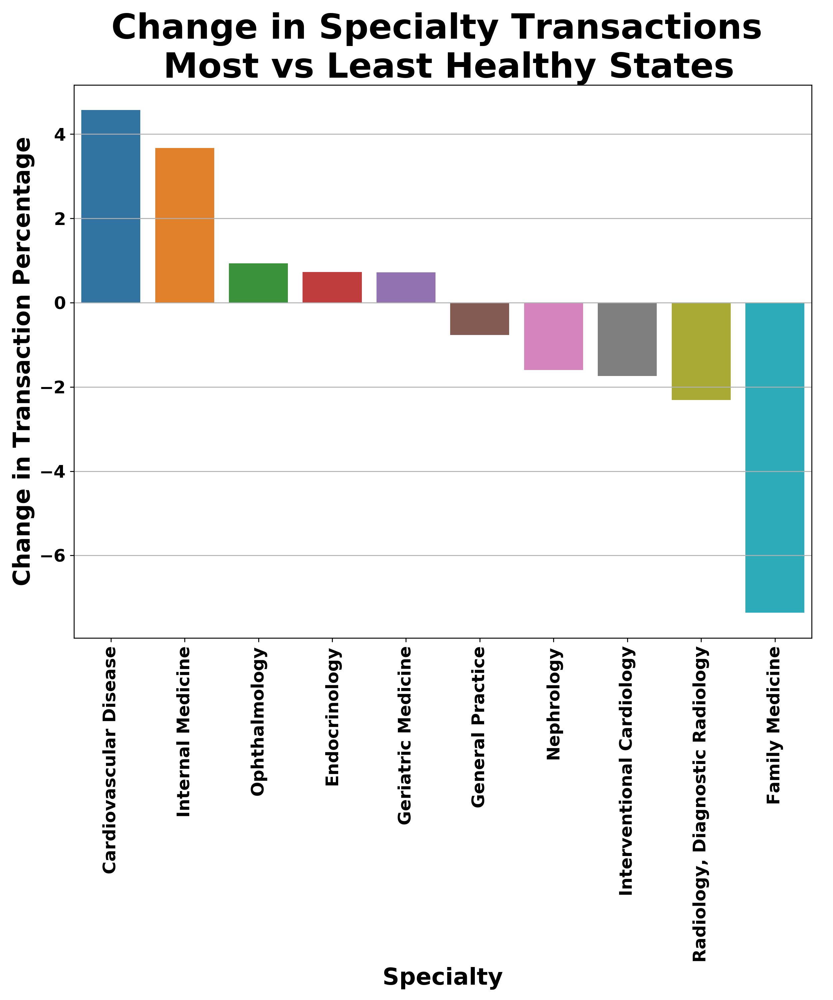

# Healthcare_referral_patterns

The goal of this project was to analyze Medicare claims data to look for referral patterns. For this project, referrals are considered to be any subsequent claim following the initial claim within 50 days. The data for this project can be found at the following locations:

* DocGraph Hop Teaming Dataset (the 2017 Free version): https://careset.com/datasets/

* The NPPES Data Dissemination Full Replacement Monthly NPI File (the big one): https://download.cms.gov/nppes/NPI_Files.html

* The December 2019 POS CLIA CSV File and Layouts:
https://www.cms.gov/Research-Statistics-Data-and-Systems/Downloadable-Public-Use-Files/Provider-of-Services/

For my project, I wanted to compare the referral patterns from states that are classified as "Healthy" to states that are classified as "Least Healthy" based upon the United Health Foundation's 2019 Annual America's Health Rankings. The referrals were compared by specialty department and done based on the percentage of overall referrals the 5 healthy/unhealthy states. 

